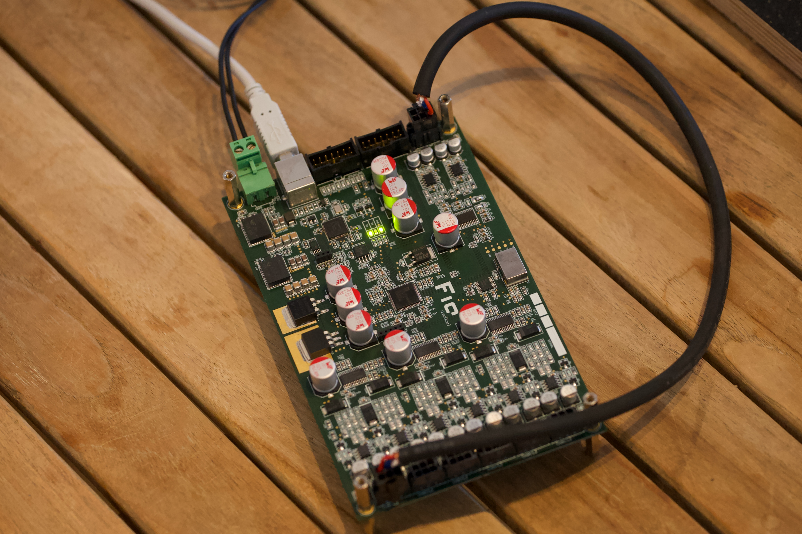

# dspCore  

The dspCore is built around the ADAU1452 / ADAU1462 / ADAU1466 DSPs from Analog Devices, featuring balanced 2-in / 6-out audio, along with support for I2S, SPDIF, and TDM. This board is optimized for low-noise performance and specifically designed to support the features of the [ICEpower 300A1](https://shop.icepoweraudio.com/product/300a1/) and similar amplifier modules.  

The first prototype was built in 2014, redesigned in 2016, and the latest version was finalized in 2021, primarily to replace conflict materials like tantalum. The I2S input has been successfully tested with Raspberry Pi 3/4/5 and ESP32-S3.  

---

## Design Requirements  

- Balanced 2-in / 6-out audio  
- Ultra-low idle noise without an active mute circuit (optimized for compression drivers >100dB/1W/1m)  
- Stereo 3-way active crossover with FIR support for mid-high frequencies  
- Flexible I2S interface  
- Compatible with 48V DC battery operation  

---

## Hardware Overview  

  

**Key Components:**  
- **DSP:** [ADAU1466](https://www.analog.com/en/products/adau1466.html) or [ADAU1452](https://www.analog.com/en/products/adau1452.html)  
- **A/D Converter:** [CS5381](https://www.cirrus.com/products/cs5381/)  
- **D/A Converter:** [CS4389](https://www.cirrus.com/products/cs4398/)  
- **Op-Amps:** [OPA1612](https://www.ti.com/product/de-de/OPA1612/part-details/OPA1612AID)  
- **Clock Oscillator:** [CCHD-957](https://www.crystek.com/home/oscillator/clockdetail.aspx?pn=CCHD-957)  
- **USB Controller:** [CY7C68013A](https://www.infineon.com/cms/de/product/universal-serial-bus/usb-2.0-peripheral-controllers/ez-usb-fx2lp-fx2g2-usb-2.0-peripheral-controller/cy7c68013a-56ltxc/)  

---

## Measurements  

The **Poor Engineer's Distortion Analyzer** is used to measure the distortion performance. Inspired by KJBob (@ADI EngineeringZone), the measurements involve a loopback setup (DSP → D/A → A/D → DSP). Results are close to the datasheet specifications of the CS4398, though external verification was not performed.  

### Device Under Test (DUT)  
  

### 1V RMS Measurement  
```plaintext
0.000527918% THD+N = -105.54dB (A-weighted)
```  
_thd+n.jpeg)  

### 2V RMS Measurement  
```plaintext
0.000626624% THD+N = -104.06dB (A-weighted)
```  
_thd+n.jpeg)  

---

## To-Do  

- Migrate PCB design from Eagle to KiCad  

---

## Use Case  

  
  

---

## License  

The hardware is licensed under **CC BY-SA 4.0**.  
